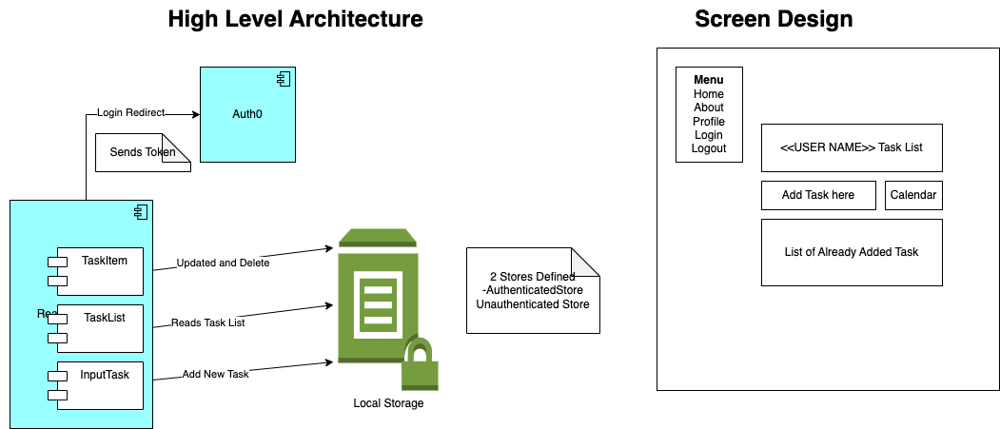

# About
A simple application to login using Auth0 CIAM and manage Tasks

# Architecture

# Components
TaskList - Print the list of Tasks the user has
TaskItem - Manage the completed, edit and deletion of task
InputTask - for inserting new task

# Store
Uses the Zustand library to create a store. The information is persisted in local browser storage
unAuthenticatedStore - Store for user without credential
AuthenticatedStore - Store for user who have logged in

# CIAM
Auth0 is used as CIAM and Login and password are managed within it

